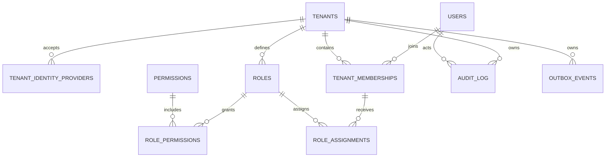

# Blok A — tenant, identita, RBAC a RLS

## Rozsah

Blok A implementuje pouze organizace, globální identity uživatelů, členství uživatele v organizaci, tenantové role, oprávnění, přiřazení rolí, vazbu workspace na Microsoft Entra tenant, bezpečnostní audit a transactional outbox. Tabulky projektů, jednotek, klientů, obchodních případů, cen a smluv v této migraci nejsou.

Stávající D1 databáze zůstává dočasně pouze úložištěm klikacího prototypu. Produkční model bloku A je izolovaný v PostgreSQL migraci; tím se současné UI ani mock data nepřepisují.

## Datový model

## Role a oprávnění

Výchozí role založené při vytvoření tenantu jsou `admin`, `project_manager`, `sales` a `back_office`. Role jsou běžná data tenantu; správce proto může později vytvořit vlastní roli bez změny schématu.

Oprávnění v bloku A:

- `tenant.read`, `tenant.manage`
- `membership.read`, `membership.invite`, `membership.manage`
- `role.read`, `role.manage`, `role.assign`
- `audit.read`

`admin` má všechna oprávnění. Zbylé role dostanou v bloku A bezpečné minimum `tenant.read`, `membership.read` a `role.read`; doménová oprávnění budou přidána s příslušnými moduly.

Přiřazení rolí je v bloku A pouze tenantové. Projektové přiřazení bude samostatná tabulka s cizím klíčem na `projects` v bloku B. Nepoužívá se polymorfní `scope_type + scope_id`, protože by dnes nebylo možné garantovat referenční integritu.

## RLS strategie

- API po ověření Entra JWT zahájí databázovou transakci a přes `set_config(..., true)` nastaví `app.user_id`, `app.identity_issuer`, `app.identity_subject` a po výběru workspace také `app.tenant_id`.
- Všechny tenantové tabulky mají `ENABLE` i `FORCE ROW LEVEL SECURITY`.
- Členství lze před výběrem workspace číst pouze pro `app.user_id`; ostatní čtení i všechny zápisy vyžadují shodu s `app.tenant_id`.
- Uživatel vidí pouze vlastní globální identitu. Tenant je před výběrem workspace viditelný jen tehdy, pokud k němu má aktivní členství.
- `WITH CHECK` brání vložení či přesunu řádku do jiného tenantu i při chybě v aplikačním dotazu.
- API role nevlastní tabulky, nemá `BYPASSRLS` a nedostává právo měnit schéma.
- Background worker používá stejný tenantový kontext po jednotlivých outbox událostech; globální bypass role není součástí pilotního runtime.

## Mazání a archivace

- Tenant, uživatel, členství a role se nemažou běžným API; používá se `status`/`archived_at`.
- Členství nelze deaktivovat, pokud by tím tenant přišel o posledního aktivního administrátora (aplikační transakce a zamčený kontrolní dotaz).
- Oprávnění jsou systémový číselník a nemažou se.
- Přiřazení rolí lze odvolat fyzickým smazáním; změna se vždy zapisuje do auditu.
- Audit je append-only. Outbox lze po úspěšném doručení archivovat retenční úlohou, nikoli měnit doménový obsah události.

## Entra ID

Backend ověřuje podpis, issuer, audience, expiraci a `tid` tokenu pomocí Microsoft JWKS. Až následně vyhledá globálního uživatele podle stabilní dvojice `issuer + oid/sub`. Vybraný workspace musí mít aktivní vazbu na stejné Entra `tid` a uživatel v něm aktivní členství. Pilot používá Bearer tokeny; privátní síť a Azure Service Bus zůstávají připravené, ale nejsou nutné pro spuštění bloku A.
