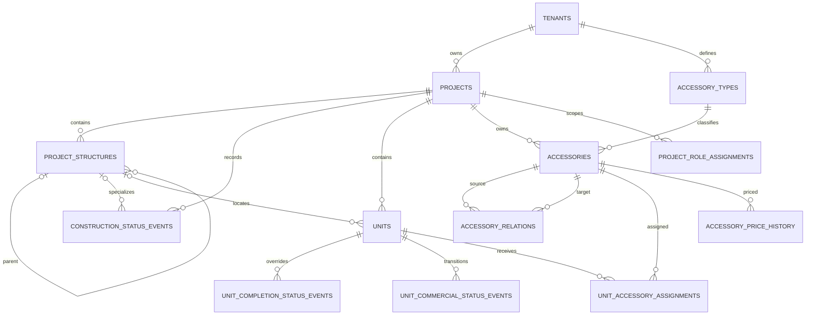

# Blok B — projekty, jednotky a příslušenství

## Rozsah

Blok B přidává pouze projektový katalog: `projects`, `project_structures`, stavební události, `units`, individuální completion override, obchodní status a jeho události, typy a instance příslušenství, vazby příslušenství, časová přiřazení k jednotkám, ceny příslušenství a projektově omezené role. Neobsahuje klienty, parties, zájmy, sales cases, holds, smlouvy ani cenu jednotky.

## Hlavní vztahy

Všechny vazby na projekt, strukturu, jednotku a příslušenství používají `tenant_id` v kompozitním cizím klíči. Každá tabulka bloku B má `ENABLE ROW LEVEL SECURITY` a `FORCE ROW LEVEL SECURITY`.

## Stav výstavby

Projekt a každá struktura mají append-only `construction_status_events`. Efektivní stav jednotky se vyhodnocuje v tomto pořadí:

1. poslední účinný `set_override` jednotky;
2. poslední účinná událost nejbližší struktury;
3. postupně rodičovské struktury;
4. poslední účinná projektová událost.

`clear_override` vrací jednotku k děděnému stavu. Projektový stav se nikdy mechanicky nekopíruje do všech jednotek.

## Obchodní status

`units.commercial_status` je aktuální projekce chráněná triggerem. Přímý update skončí chybou. Funkce `app.transition_unit_commercial_status` v jedné transakci zamkne jednotku, ověří přechod a aktéra, aktualizuje projekci a zapíše historii, audit a outbox.

V bloku B jsou z aplikační služby dostupné pouze `blockUnit` a `unblockUnit`. Příkazy vyžadující hold nebo smlouvu jsou záměrně odmítnuty, dokud blok C/D nepřidá jejich zdrojové tabulky a invarianty. Preview seed může jako vlastník migrace vložit počáteční stav s příkazem `seed`.

## Příslušenství

- `accessory_types.allows_sharing` určuje, zda může mít příslušenství překrývající se aktivní přiřazení.
- Před každým přiřazením se instance příslušenství zamkne; tím se kontrola překryvu chová korektně i při souběžných transakcích.
- `installed_at` vyžaduje wallbox jako zdroj a parking nebo garáž jako cíl.
- Cena příslušenství je append-only událost s `valid_from`. Konec intervalu se odvozuje pomocí následujícího `valid_from`; intervaly se proto konstrukčně nemohou překrývat a unikátní constraint odmítá dva záznamy se stejným počátkem.

## Repository hranice

Frontendové komponenty dál používají stejný prezentační model. `CatalogRepository` načte buď přesný preview dataset, nebo backendový `/v1/catalog`. Adaptér mapuje schválené statusy do existujících českých badge názvů. Klient, předání a cena jednotky zůstávají do bloků C/D pouze součástí preview adaptéru; v PostgreSQL bloku B se neduplikují.
