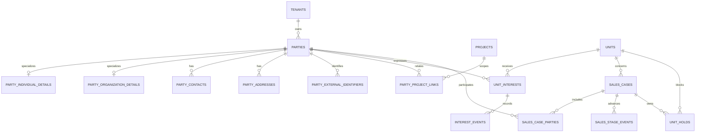

# Blok C — parties, zájmy, sales cases a rezervace

## Rozsah

Blok C přidává canonical `parties`, typově oddělené detaily FO/PO, kontakty, adresy, externí a šifrovatelné soukromé identifikátory, projektové vztahy, trvalou historii zájmu, technické `sales_cases`, více účastníků a časově omezené `unit_holds`. Smlouvy, jejich verze a cena samotné jednotky zůstávají výhradně v bloku D.

## Canonical identity a deduplikace

`parties` je jediný zdroj identity. Projekt a jednotka se k osobě nevážou kopií klienta, ale FK přes `party_project_links`, `unit_interests` a `sales_case_parties`. E-mail záměrně není unikátní. Tvrdé deduplikační klíče jsou externí identifikátor v rámci zdrojového systému, IČO právnické osoby a deterministický hash šifrovaného soukromého identifikátoru. Nejasné shody se řeší explicitním sloučením pomocí `merged_into_party_id`, nikoli automaticky podle jména nebo e-mailu.

`party_private_identifiers` ukládá pouze ciphertext, deterministický hash, verzi klíče a volitelné poslední čtyři znaky. Preview seed tuto tabulku záměrně neplní.

## Sales case a historie zájmu

Jednotka může mít libovolně mnoho historických `unit_interests` a uzavřených `sales_cases`, ale unikátní částečný index dovoluje nejvýše jeden aktivní sales case. Jeden sales case může mít více kupujících a právě jednoho aktivního primárního účastníka. Události zájmu i etap jsou append-only; vznik ani ukončení rezervace je nemaže.

## Doménové operace holdů

`app.create_unit_hold`, `app.convert_pre_reservation`, `app.cancel_unit_hold` a `app.expire_unit_hold` jsou jedinou zapisovací cestou pro rezervace. Operace zamykají jednotku, kontrolují `holds.manage` v projektovém scope a v jedné transakci udržují hold, sales case, účastníky, stage event, `units.commercial_status`, audit a outbox.

Expirace je idempotentní. Jednotka se vrátí na `available` pouze pokud už neexistuje jiný platný hold a její projekce stále odpovídá právě expirovanému typu. `app.enqueue_expiring_holds` vytváří jednorázové `hold.expiring.v1` události pro budoucí notifikační worker; samotný notifikační modul v tomto bloku nevzniká.

## Repository hranice

`SalesRepository` vrací společný klientský adresář a obchodní kontext jednotek pouze z projektů, na které má membership `clients.read` / `sales_case.read`. Export znovu vyhodnocuje `clients.export` pro každý projekt a nikdy nespoléhá na výběr provedený jen ve frontendu. `ClientRepository` ve frontendu přepíná preview seed a produkční API bez změny prezentačních komponent.

Na repository jsou napojené: globální tabulka a hledání klientů, projektový seznam klientů, detail klienta, kupující a historie zájmu jednotky, prodejní etapa a aktivní hold, BCC a CSV export.
