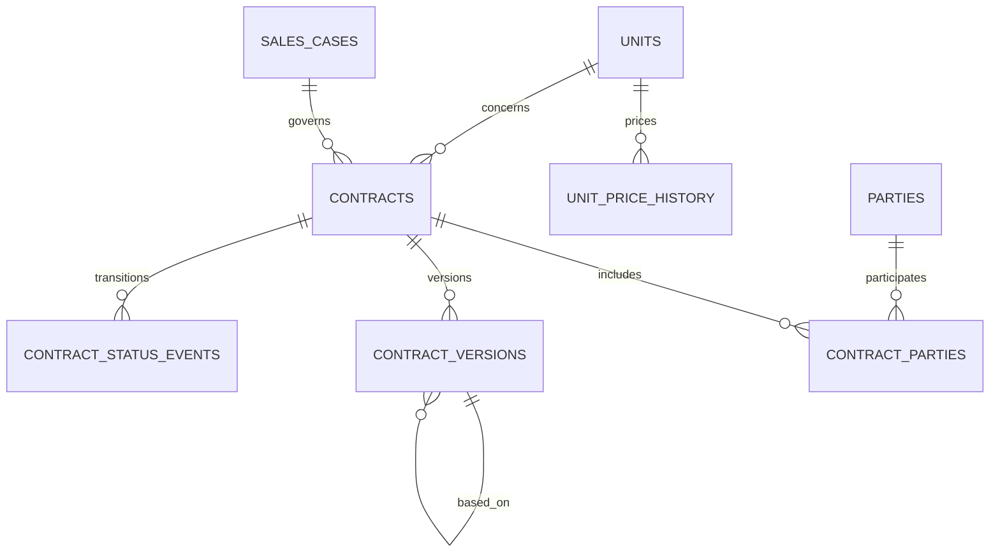

# Blok D — ceny jednotek a smlouvy

## Rozsah

Blok D uzavírá první implementační etapu. Přidává append-only cenové události jednotek, odvozenou aktuální cenu, smlouvy RS/SBK/KS/dodatky, smluvní účastníky, logické verze a řízený workflow. Fyzické DOCX soubory ani SharePoint synchronizace nejsou součástí bloku; datový model obsahuje pouze budoucí externí identifikátory dokumentu a generation payload.

## Ceny

`unit_price_history` rozlišuje `list_price`, `individual_discount`, `sale_price` a `contract_price`. Záznamy nelze měnit ani mazat. Efektivní interval končí následujícím záznamem stejného typu; unikátní efektivní bod proto vylučuje překryv. `app.current_unit_price` preferuje smluvní cenu, poté prodejní cenu a nakonec ceníkovou cenu sníženou o individuální slevu. Slevy a smluvní ceny vyžadují schvalující membership.

Jediný doménový zápis `app.record_unit_price` kontroluje projektové `price.manage` / `price.approve` a atomicky zapisuje cenovou událost, audit a outbox `unit.price_recorded.v1`.

## Smlouvy a verze

Typ smlouvy není obchodní status jednotky. Každá smlouva má workflow `draft → sent ↔ negotiation → approved → signing → signed`; ze stavů před podpisem lze smlouvu zrušit a podepsanou smlouvu ukončit. Přímé nastavení `signed` není dovoleno. Podepsání všech povinných `contract_parties` uzamkne právě schválenou verzi, podepíše smlouvu a podle typu atomicky posune `sales_case`: RS na `rs`, SBK na `sbk` a jednotku na `contracted`, KS na `ks` a jednotku na `sold`.

Podepsaná verze, její účastníci a historické stavové události jsou immutable. Nová pracovní verze může odkazovat na předchozí pomocí `based_on_version_id`; FK zároveň zaručuje, že jde o verzi stejné smlouvy.

Ukončení podepsané smlouvy samo automaticky neuvolní jednotku. Právní ukončení nemusí vždy znamenat okamžité vrácení do nabídky, takže budoucí compensating business operace musí výslovně vyhodnotit aktivní smlouvy, holdy a sales case.

## Repository a UI

`CommercialRepository` poskytuje jediný projektově filtrovaný snapshot aktuálních cen, cenové historie, smluv, účastníků a verzí. Frontendový `CommercialRepository` přepíná preview seed a backend API bez změny komponent. Napojené pohledy jsou: ceny v seznamu/preview/detailu jednotky, historie cen, smlouvy jednotky, globální smlouvy a jejich dashboardové souhrny.

Všechny tabulky bloku D používají `tenant_id`, composite FK a vynucené RLS. Čtení repository navíc kontroluje `price.read` nebo `contract.read` v projektovém scope; doménové příkazy kontrolují zapisovací oprávnění znovu v databázi.
